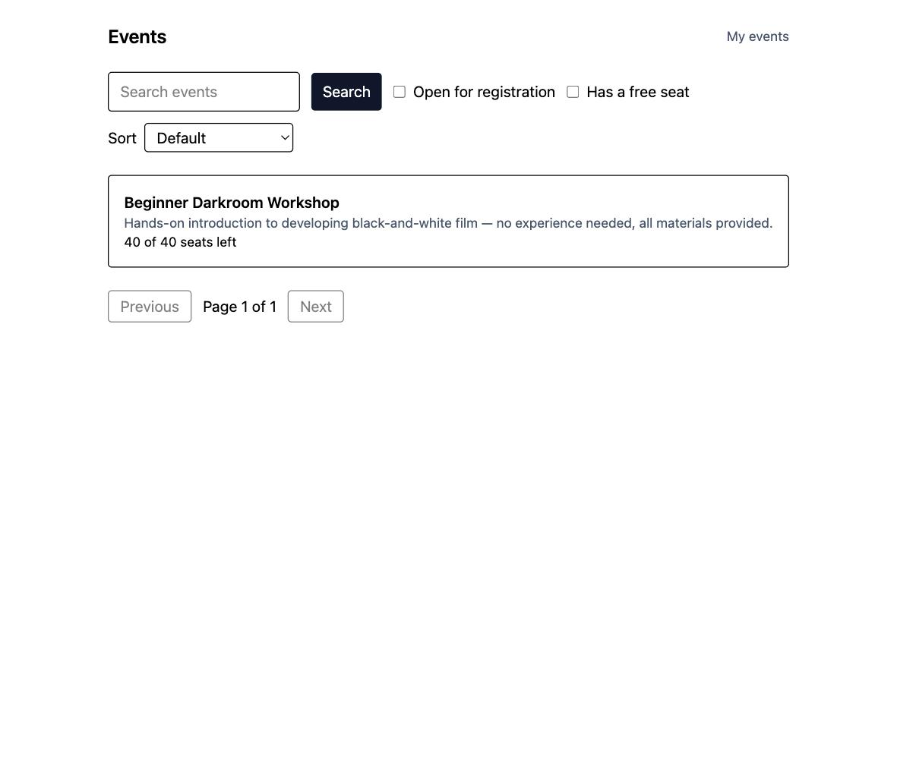
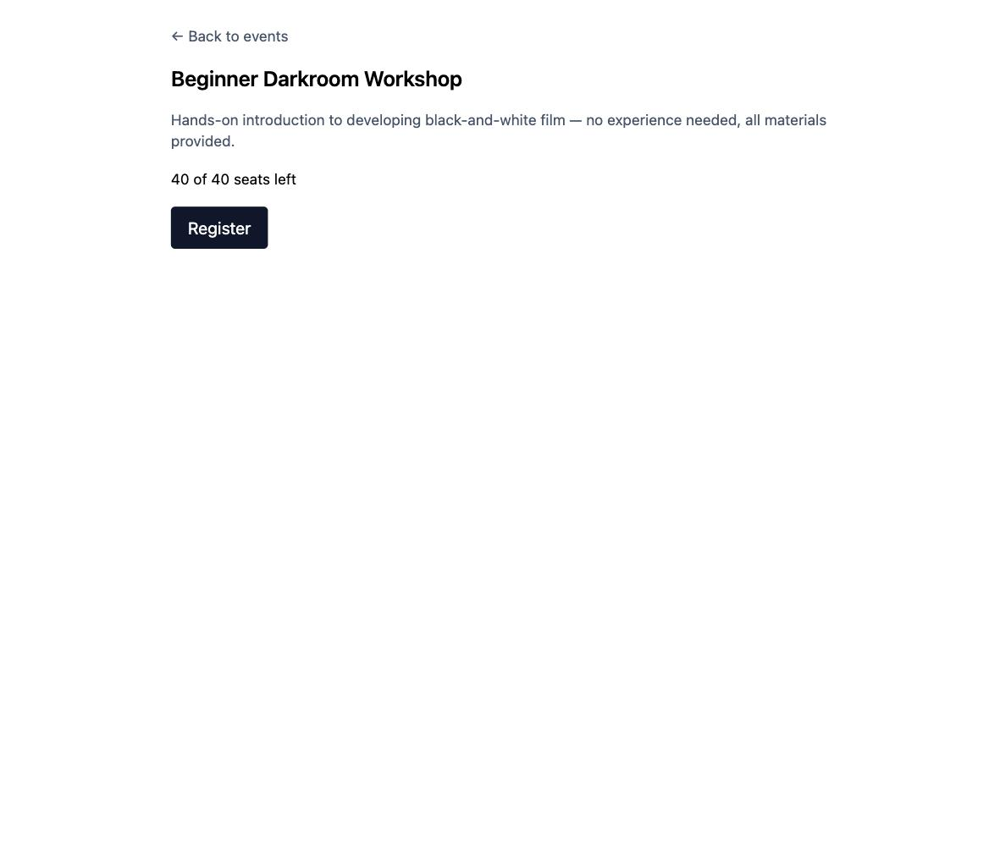
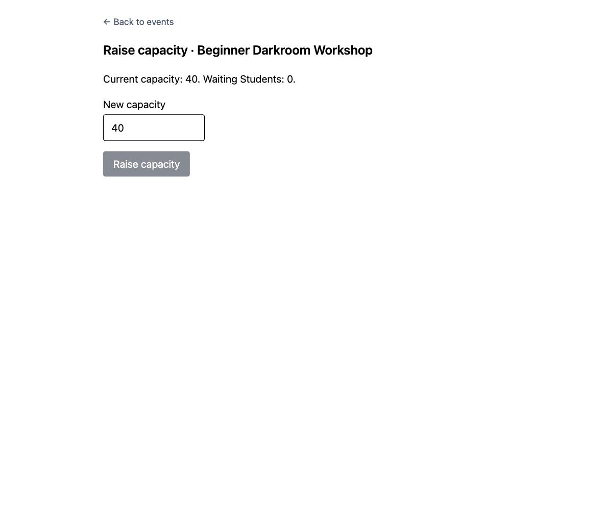
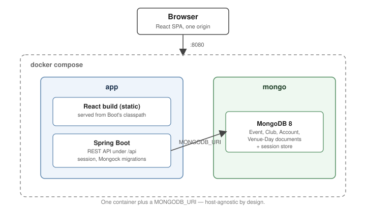
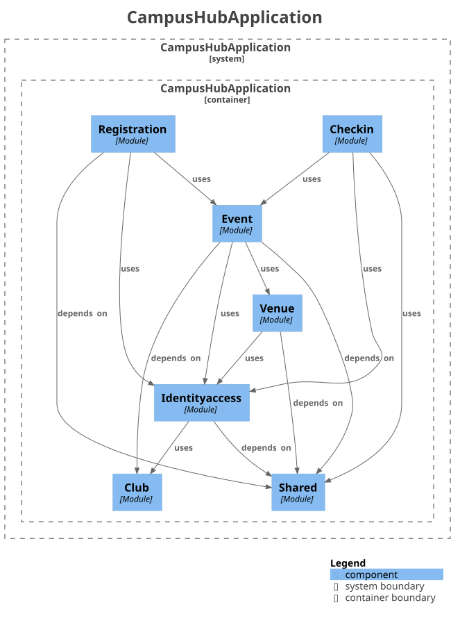

# CampusHub

Campus club events, from signup to the door.

CampusHub is a document-modelled events platform for campus clubs: a Club Officer publishes an
Event with a custom registration form, books it into a Venue, and a Student registers, joins the
Waitlist if the Event is full, and is promoted automatically the moment a Seat frees up. No two
Students ever win the same Seat, and no two Events ever collide in the same room at the same time —
each of those claims is a test, not a hope, and this README links to both.

There is no public URL yet — that arrives with the release Issue. Everything below runs locally.

## Screenshots

| Student browses Events | Student registers | Officer manages capacity |
|---|---|---|
|  |  |  |

## Quick start

```
cp .env.example .env
docker compose up --build
```

Then open [localhost:8080](http://localhost:8080) and sign in with a demo account:

| Role | Email | Password |
|---|---|---|
| Student | `student@demo.campushub` | `123456` |
| Club Officer | `officer@demo.campushub` | `123456` |
| University Admin | `admin@demo.campushub` | `123456` |

These are demo credentials for a demo dataset, seeded only by the `development` Spring profile that
`.env.example` activates — see [Issue #2](https://github.com/Jamiedz999/campushub/issues/2). Signing
in as the Student lands on an already-published, already-open Event: **Beginner Darkroom Workshop**.
There is no self-service sign-up; these three accounts are the only way in.

## Architecture

**One container plus a `MONGODB_URI`.** React is built to static assets and served by Spring Boot
from the same origin as its own REST API, so there is exactly one process to run and one port to
open.



The module diagram below is **generated from the code by Spring Modulith**, not drawn — CampusHub
rejected the hand-maintained-diagram pattern twice already, for [Phase](docs/adr/03-define-event-lifecycle.md)
and for [stored state](docs/adr/17-define-code-structure-and-its-enforcement.md), and a module map
that can silently drift from the import graph is the same mistake. Regenerate it with
`./server/mvnw -Dtest=ModularityTest test`, which writes
`server/target/spring-modulith-docs/components.puml`; the checked-in SVG is that file rendered with
`plantuml`.



## The engineering story

CampusHub's whole concurrency argument is one sentence: **only the Seat has to be atomic. Everything
else is allowed to be eventually consistent.** Three places apply it, and each one names the test
that proves it rather than just asserting it.

- **The Seat Ledger resolves every registration race in one guarded write.** Capacity, the
  Registration Window and the duplicate check are all one `findOneAndUpdate` against the Event
  document — no lock, no read-then-write window. See
  [the registration ADR](docs/adr/04-define-registration-capacity-and-waitlist.md) and the
  concurrency test that fires parallel registrations at a small capacity and asserts exactly that
  many win: `EventRepositorySeatLedgerIntegrationTest.nParallelRegistrationsAgainstACapacityOfMProduceExactlyMEnrolments`
  (`server/src/test/java/com/campushub/event/persistence/EventRepositorySeatLedgerIntegrationTest.java:310`).

- **The Venue-Day document turns interval overlap into one atomic predicate.** A `$not`/`$elemMatch`
  guard evaluated by the server as part of the write **is** the overlap check, so there is nothing to
  lock. See [the Venue and Slot ADR](docs/adr/06-define-venue-slot-booking.md) and the test that fires
  two overlapping bookings at the same Venue in parallel and asserts exactly one wins:
  `VenueModuleImplIntegrationTest.parallelOverlappingSlotRequestsHaveExactlyOneWinner`
  (`server/src/test/java/com/campushub/venue/internal/VenueModuleImplIntegrationTest.java:53`).

- **The door proves presence and identity separately, and neither half alone admits anyone.** The
  screen at the door shows a code that is an HMAC over the Event and a 60-second window, so it is
  worthless a minute later and possessing it means having seen a screen that is in the room; who
  scanned it comes from their signed-in session. Nothing about the code is stored — it is verified by
  recomputation — and the attendance write itself is one guarded append with the Roster check and an
  idempotency guard in its filter. See
  [the check-in ADR](docs/adr/07-define-qr-checkin-and-anti-fraud.md), which is equally clear about
  what this does *not* defeat, and the test that fires parallel scans by one Student and asserts
  exactly one record exists:
  `EventRepositoryAttendanceIntegrationTest.nParallelScansByOneStudentProduceExactlyOneAttendanceRecord`
  (`server/src/test/java/com/campushub/event/persistence/EventRepositoryAttendanceIntegrationTest.java:201`).

- **The live attendee count is pushed as a hint, never as a number.** The door screen's WebSocket
  carries one message — "something changed in this Event's scope" — and the screen answers it by
  re-reading an authorized snapshot over HTTP, which it also does on every reconnect. So a lost frame
  or a dropped connection costs latency and never correctness, and there is no delivery guarantee to
  build. Subscription is authorized once, at the handshake, where the connection is still an HTTP
  request with a session behind it. See
  [the check-in ADR](docs/adr/07-define-qr-checkin-and-anti-fraud.md) and the test that drops a
  screen, lets it miss three hints and proves the server owes it no backlog:
  `DoorScopeSocketIntegrationTest.aReconnectedScreenIsOwedNoBacklogOfWhatItMissed`
  (`server/src/test/java/com/campushub/realtime/internal/DoorScopeSocketIntegrationTest.java:153`).

- **Phase is derived, so it can never contradict its own timestamps.** Only Status (Draft, Published,
  Cancelled) is stored; every other reading — Scheduled, Registration Open, Full, Registration
  Closed, In Progress, Completed — is computed on read from Status, four timestamps and the Seat
  Ledger. Nothing writes it, so nothing can leave it stale. See
  [the Event lifecycle ADR](docs/adr/03-define-event-lifecycle.md) and `PhaseTest`, which checks
  every row of the Phase table at the exact instant it takes over from the last one, e.g.
  `atTheExactInstantRegistrationOpensPhaseBecomesRegistrationOpen`
  (`server/src/test/java/com/campushub/event/domain/PhaseTest.java:43`).

- **Three journeys drive the whole stack in CI, and the one thing they cannot do is named.** Cypress
  runs against `docker compose` — one origin, a real session cookie, real MongoDB, no stubbed API —
  over registration to Waitlist to Promotion, an Officer publishing and booking a Venue and being
  refused the second claim on it, and a Student getting through the door and appearing on the
  dashboard. That third journey **posts a server-derived code to the check-in endpoint rather than
  scanning it**, because a headless browser cannot read a QR code: the camera is the one link in that
  chain the E2E does not cover, and the spec says so instead of letting the journey look complete.
  Each journey creates the Event it acts on, so CI runs the set twice in a row against the same stack
  — and Cypress's retry count is zero, because a journey that needs a second attempt is a journey
  that is wrong. `web/cypress/e2e/`.

- **The logs cannot name a Student, so the response header is what you trace by instead.** Email
  addresses and identifiers are masked in the log layout rather than at the call sites, which means a
  line written inside Spring, inside a library, or in code nobody has written yet is redacted on the
  way out too. That costs the logs their identifiers, so every request is given a correlation id
  before the security filter chain sees it — carried on every line it writes and on the response,
  including the 401 that never reached a controller — and that id is the handle a bug report starts
  from. The test is a full journey run at `DEBUG` whose log output is then grepped for the Student's
  email, id, display name and form answers, plus a line that deliberately logs an identifier and is
  watched coming out masked, because otherwise a clean grep would only prove that nothing had tried.
  **It caught one**: at `DEBUG`, Spring writes response bodies into the log, so the answers CSV an
  Officer exports went in verbatim — name and answer together — and one turned-up log level would
  have published exactly what the privacy boundary exists to protect. That package is now pinned at
  `INFO`, with the test holding it there.
  `server/src/test/java/com/campushub/shared/logging/RedactedLoggingIntegrationTest.java`.

## What this deliberately doesn't do

Promotion never holds a Seat with a timeout — a promoted Student is enrolled outright, because
confirmation-with-holds is the most expensive complexity on offer for a problem free campus events
don't have. There's no reconciliation sweep for promotion or orphan bookings, because both paths are
already atomic and a sweep would only be a safety net for a mechanism that doesn't fail. And there's
no University approval step before an Event goes live, because it adds a rejection branch and a
notification path this single-account demo doesn't need. Each of these is argued in full, alongside
everything else left out of Core, in the
[Future Work table](docs/planning/13-set-core-boundary-and-sprints.md#future-work).

## More

- [`CONTEXT.md`](CONTEXT.md) — the domain glossary.
- [`docs/adr/`](docs/adr) — every architectural decision, as a resolved question and answer.
- [`docs/planning/map.md`](docs/planning/map.md) — how the Sprints were derived.
